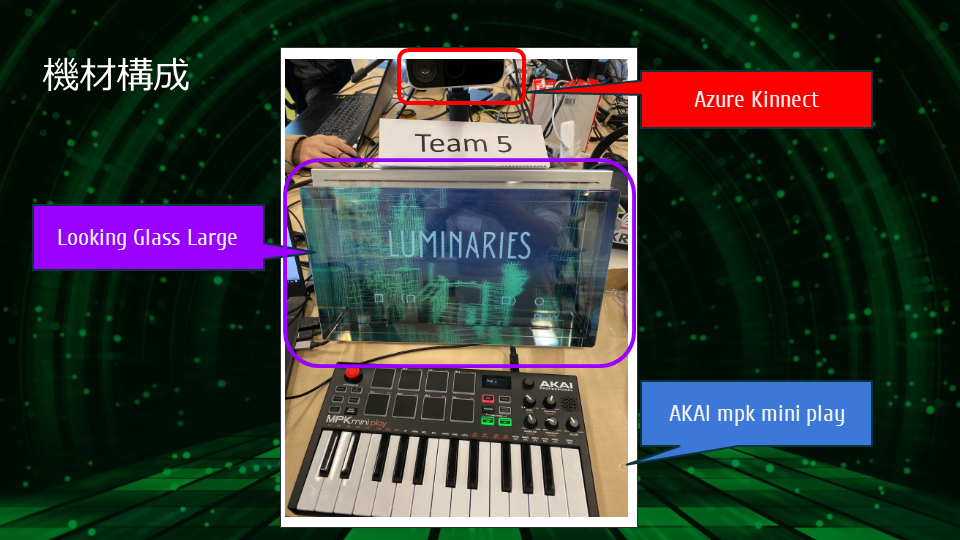
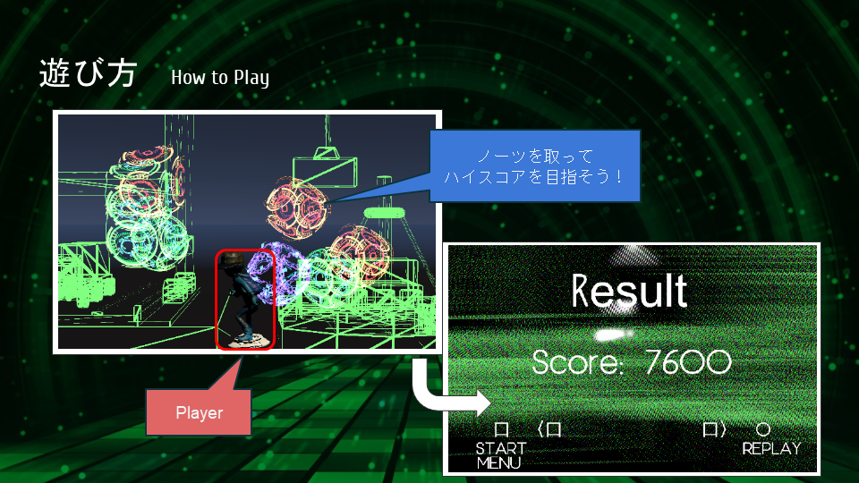
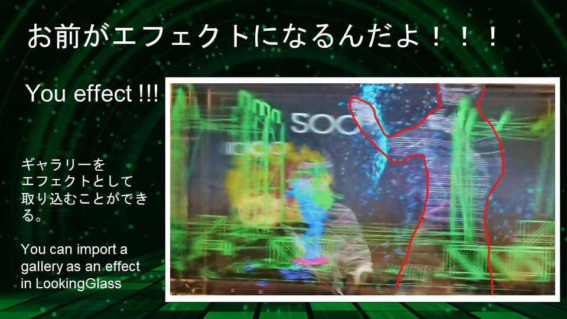

+++
# Project title.
title = "Luminaries"

# Date this page was created.
date = 2019-11-09T00:00:00

# Project summary to display on homepage.
summary = "第2回Looking Glassハッカソンで優勝したゲームです！"

# Tags: can be used for filtering projects.
# Example: `tags = ["machine-learning", "deep-learning"]`
tags = ["Application", "Azure Kinect", "Game", "Hackathon", "Looking Glass", "MIDI", "Unity", "xR"]

# Optional external URL for project (replaces project detail page).
external_link = ""

# Slides (optional).
#   Associate this project with Markdown slides.
#   Simply enter your slide deck's filename without extension.
#   E.g. `slides = "example-slides"` references 
#   `content/slides/example-slides.md`.
#   Otherwise, set `slides = ""`.
slides = ""

# Links (optional).
url_pdf = ""
url_slides = ""
url_video = ""
url_code = ""

# Custom links (optional).
#   Uncomment line below to enable. For multiple links, use the form `[{...}, {...}, {...}]`.
# links = [{icon_pack = "fab", icon="twitter", name="Follow", url = "https://twitter.com/segur_vita"}]

# Featured image
# To use, add an image named `featured.jpg/png` to your project's folder. 
[image]
  # Caption (optional)
  caption = "Luminaries"

  # Focal point (optional)
  # Options: Smart, Center, TopLeft, Top, TopRight, Left, Right, BottomLeft, Bottom, BottomRight
  focal_point = "Smart"
+++

**第2回Looking Glassハッカソンで優勝した作品です！**

5人のチームで開発しました。

メンバーが持ち込んだ機材の中に、

- Looking Glass Large
- Azure Kinect
- MIDIキーボード (AKAI mpk mini play)

がありましたので、これらを組み合わせてゲームを作りました！

プレイヤーを操作して、道中に登場するノーツを取りながらハイスコアを目指すゲームです！

MIDIキーボードは、プレイヤーの操作だけでなく、音やエフェクトにも影響します！



加えて、ゲームをプレイしている人の後ろに人だかりができると、Azure Kinectで撮影したポイントクラウドがVFXで表示されます！

このように折り重なるサウンドとVFXによって、すごく盛り上がるゲームとなりました！！

## 概要

- 開発環境: Unity
- 動作環境: Looking Glass
- 担当箇所: ステージ制作・シェーダー・シーン制御プログラム・プレゼン資料作成等

## 展示

- [第2回 Looking Glass ハッカソン](https://lookingglass.connpass.com/event/150321/)
- [Looking Glass Factory ハッカソンショーケース ＠FabCafe](https://www.facebook.com/events/464961161032180/)
- [サウンドミニハッカソン＃７ルキグラスもくもく会](https://effectorhack.connpass.com/event/155846/)

