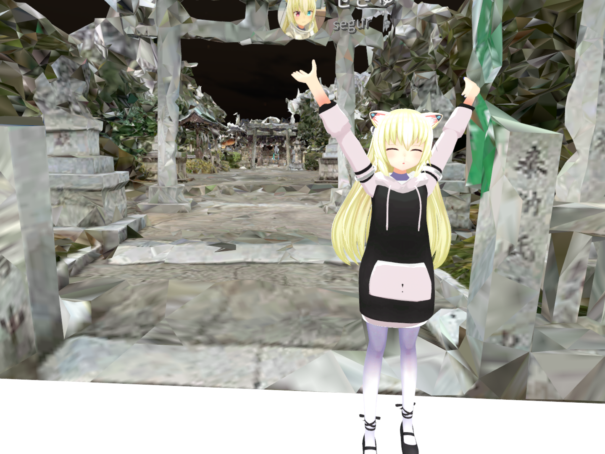

+++
# Project title.
title = "Kumano Shrine"

# Date this page was created.
date = 2020-03-28T14:00:00

# Project summary to display on homepage.
summary = "神社をフォトグラメトリーで再現しました。xR Tech Nagoya #11で最優秀賞を受賞した作品です。"

# Tags: can be used for filtering projects.
# Example: `tags = ["machine-learning", "deep-learning"]`
tags = ["Art", "Blender", "cluster", "Photogrammetry", "STYLY", "Unity", "xR", "Zephyr"]

# Optional external URL for project (replaces project detail page).
external_link = ""

# Slides (optional).
#   Associate this project with Markdown slides.
#   Simply enter your slide deck's filename without extension.
#   E.g. `slides = "example-slides"` references 
#   `content/slides/example-slides.md`.
#   Otherwise, set `slides = ""`.
slides = ""

# Links (optional).
url_pdf = ""
url_slides = ""
url_video = ""
url_code = ""

# Custom links (optional).
#   Uncomment line below to enable. For multiple links, use the form `[{...}, {...}, {...}]`.
# links = [{icon_pack = "fab", icon="twitter", name="Follow", url = "https://twitter.com/segur_vita"}]

# Featured image
# To use, add an image named `featured.jpg/png` to your project's folder. 
[image]
  # Caption (optional)
  caption = ""

  # Focal point (optional)
  # Options: Smart, Center, TopLeft, Top, TopRight, Left, Right, BottomLeft, Bottom, BottomRight
  focal_point = "Smart"
+++

## 概要

「2020年は広域フォトグラメトリーやるぞ！」ということで、1月から作り始めたのが本作品です。

まずは、iPhone 11 Proの超広角レンズで、神社をさまざまな角度から動画撮影しました。

その動画をFFmpegで8000枚ほどの静止画に分割し、それを3DF Zephyrでメッシュ化しました。テクスチャ付メッシュの出力までの40時間ほどかかりました！その間、PCが触れなくて辛かったです。



Blenderでちまちまとメッシュを修正し（3か月かかりましたｗ）、完成したのがこちらです。STYLYに投稿してありますので、ぜひご覧ください。



ちょうどその頃、 **xR Tech Nagoya #11** にて **フォトグラメトリコンペ** が開催されるということで、応募してみることにしました。

OBJ形式のメッシュとテクスチャ画像を合わせて15MBまでという厳しい制約がありましたので、神社の雰囲気が損なわれない範囲ギリギリの圧縮具合を探し、締切ギリギリに何とか提出しました。

おかげさまで、 **最優秀賞** を受賞させていただきました！とても嬉しいです！

## 環境

- 開発環境: Blender, FFmpeg, Unity, 3DF Zephyr
- 動作環境: cluster, STYLY

## リリース

clusterバージョン、STYLYバージョン、VRChatバージョンの3種類あります！

### clusterバージョン
xR Tech Nagoyaの運営の方々が作成したVナゴヤドームというclusterワールドに、Kumano Shrineの低ポリゴン版（10万ポリゴン）が展示されています。
エレベーターの上にありますので、是非ご覧になってください。

[cluster / Vナゴヤドーム](https://cluster.mu/w/6bbc58f2-9fd7-4c03-85d4-52147bdcfd55)

### STYLYバージョン
高ポリゴン版（140万ポリゴン）をSTYLYに投稿しております。VR機材がなくても、PCさえあれば、Webブラウザで視聴可能です！

[STYLY / Kumano Shrine](https://gallery.styly.cc/scene/a2f51be0-7085-11ea-834c-06540631ffe6)

### VRChatバージョン
高ポリゴン版（140万ポリゴン）をVRChatにも投稿しております。視聴にはVR機材が必要です。

[VRChat / Kumano Shrine](https://vrchat.com/home/launch?worldId=wrld_1fb8caf4-b035-4991-be46-5fed071d8061)

## 展示

- [xR Tech Nagoya #11](https://vrm-nagoya.connpass.com/event/170700/)
